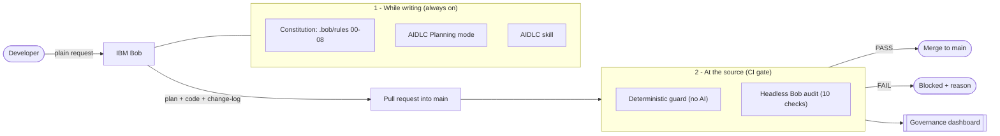
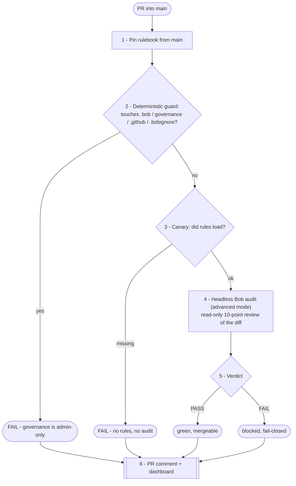

# IBM Bob × Utility Co — AIDLC Governance at the Source

> Governance is built *into how the code gets made* — IBM Bob follows an always-on rulebook and plans before it builds — and then **re-proven at the one place every change must pass through: the merge into `main`.** Nothing risky reaches the trunk unchecked, and the check can't be quietly turned off.

This is the **guarded** half of a side-by-side demo. Its unguarded twin starts from identical code; the only difference is the governance layer here. Run the same prompt in both and compare what lands.

## The story

AI writes code faster than review was built to handle. For a regulated operator like PG&E, "review it later" doesn't scale. The AWS **AIDLC** framework names four gaps: **①** is policy actually enforced? **②** is the generated code safe? **③** who made the change? **④** is there an authoritative record?

Bob closes **① and ②** by moving governance to two places that hold:
1. **Into the assistant** — an always-on Constitution and a *plan-first* mode, so the safe way is the default way while code is written.
2. **To the source** — a merge-gate check that re-proves compliance on the diff before it can join `main`.

**Why "at the source" is the right place:** the merge into `main` is the single door every change walks through. Signs saying "please write safe code" get ignored; a guard on the one door everyone uses can't be skipped (it runs on the server, not a laptop), it's the last line before harm, and every attempt is logged.

## How it works



Governance can't self-certify: the gate **pins the rulebook from `main`**, so a PR can't hand Bob a weakened Constitution to judge itself.

## The Constitution — `.bob/rules/`

Always-loaded, plain-English policies:

| Rule | Enforces |
|---|---|
| **00 · safe-constitution** | Five non-negotiable principles + a **canary token** the CI uses to prove the rules loaded. |
| **01 · secure-coding** | No inline secrets (read from env), parameterized SQL only, validate all input. |
| **02 · compliance-headers** | Every new public function/route carries a **NIST 800-53 / NERC CIP** control header. |
| **03 · audit-and-change-log** | Every code change writes a complete `change-log/` record. |
| **04 · approved-libraries** | Only allow-listed libraries; refuse others. |
| **05 · destructive-operations** | No hard deletes of regulated records; high-risk actions need a human. |
| **06 · governance-protection** | The Constitution can't be weakened by a PR. |
| **07 · aidlc-planning** | Plan first (Planning mode) before code; plans are **append-only**, **no open `[BLOCKER]`**. |
| **08 · current-date** | Read the real date from the system clock — never assume the training date. |

Plus **`.bobignore`** — Bob physically can't read `.env`, keys, or certs.

**Mode & skill:** the **AIDLC Planning mode** (`.bob/custom_modes.yaml`) clarifies open questions (marking `[BLOCKER]`s), writes the plan under `aidlc-docs/`, and only builds once blockers clear. The **AIDLC skill** (`.bob/skills/aidlc/`) runs the **Inception → Construction → Operations** workflow with a human approval gate at each phase.

## How the GitHub gate works

Every PR into `main` runs `.github/workflows/guardrail-gate.yml`:



**The 10 audit checks:** inline secrets · string-built SQL · missing input validation · hard deletes · missing compliance header · unapproved libraries · bulk/unauth actions · **governance tampering** · **missing/incomplete change-log** · **missing/blocked AIDLC plan**.

Enforcement is layered — **deterministic** where it must be, **judgment** where it helps:

| Control | Effect | Type |
|---|---|---|
| Branch protection | No direct pushes to `main`; PRs only | deterministic |
| Deterministic guard | Touch `.bob/` / `governance/` / `.github/` / `.bobignore` → instant fail | deterministic |
| CODEOWNERS | Those paths need owner review to merge | deterministic |
| Required check | `bob-guardrail-audit` must be green to merge | deterministic |
| Bob audit | Reasons about code content (safe SQL? complete plan?) | LLM judgment |

**Net effect:** governance and the CI workflow itself can only change by an admin, never through a PR.

**Dashboard** (live, GitHub Pages): pass/fail, violations by rule, group-by-contributor, every verdict.

## Run it

**1 · Fire the demo PR set** — opens 2 compliant + 8 violating PRs; watch the gate pass the good ones and block the rest:

```bash
ci-demo/run-demo-prs.sh          # the demo driver, alongside this repo
```

**2 · Try the happy path in Bob** — paste this into Bob in this workspace:

> Hey Bob — I need a new report endpoint: GET /reports/customers-by-status that returns how many customers are in each account status. Build it and open a PR to main

Bob plans it (`aidlc-docs/`), writes compliant code + a change-log, and opens a PR — the gate returns **PASS** and it lands as a green PR on the dashboard.

## App context

A small **Flask + SQLite** service for a fictional utility (customers, meters, outages, reports):

```bash
python -m venv .venv && source .venv/bin/activate
pip install -r requirements.txt
python app.py                    # PORT env var, default 5060
```

---

*Build-layer governance for the AWS AIDLC framework, shown with IBM Bob. Gaps ① and ② are closed here; Gaps ③ (agent identity — Vault/SPIFFE) and ④ (a shared audit spine — Confluent / watsonx.governance) are platform-layer, which this build-layer record is designed to feed.*
